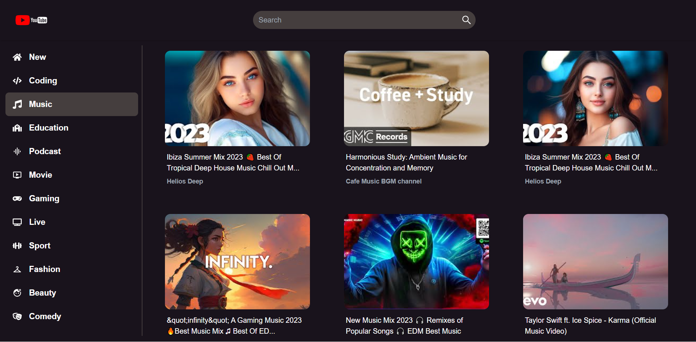

# YouTube Clone - [Live Link](https://rm-youtubeclone.netlify.app/) :point_left:

This is a YouTube clone built with React and YouTube API. It allows users to search for videos and watch them.

## Features

- Search for videos
- Watch videos
- Responsive design
- Channel Details
- Video Details

## Installation

To get started with this project, follow these steps:

1. Clone this repository to your local machine using git clone https://github.com/RaminMikayilov/Youtube-clone.git
2. Navigate to the project directory using cd movie-app
3. Install the necessary dependencies using npm install
4. Start the development server using npm run dev(because I use vite react)

The app should now be running on localhost

## Technologies Used

- React
- Context Api
- Tailwind CSS
- YouTube API
- Reacte Helmet
- React Router Dom

## Contributing

If you find any bugs, please feel free to create an issue or submit a pull request.

If you would like to contribute to the project, please fork the repository and create a pull request.

## License

This project is licensed under the MIT License - [MIT](https://choosealicense.com/licenses/mit/)
